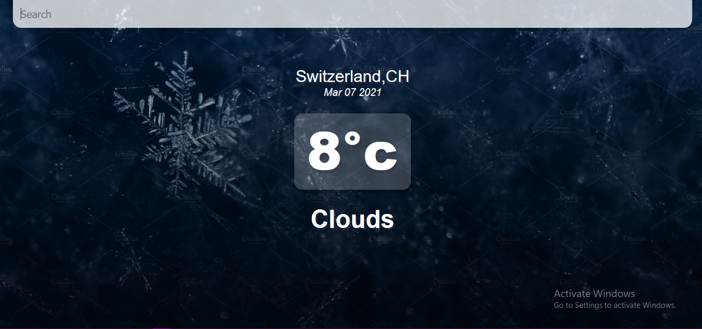
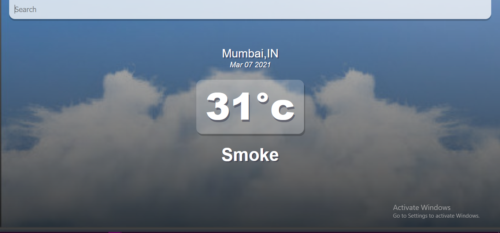

*Images used from Google Images*

# find-weather
It is a project created using React.js. It finds weather of places according to the given input. 

### API used from OpenWeatherMap https://openweathermap.org/

## Screenshots

